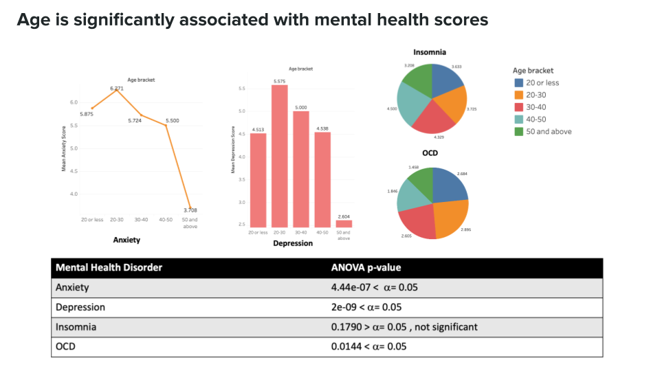
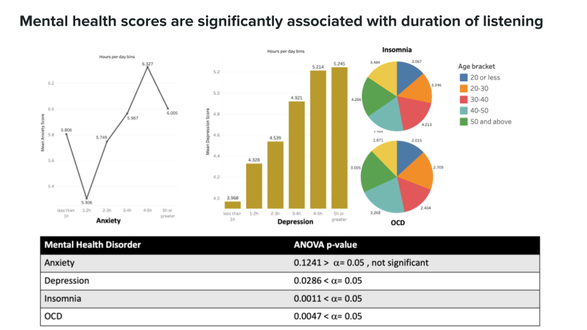
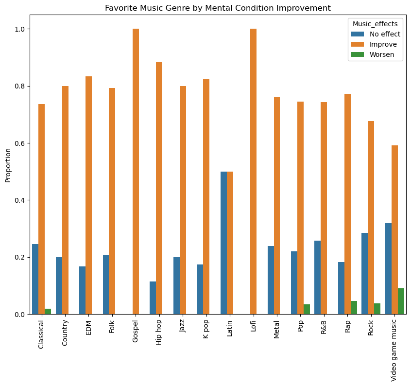
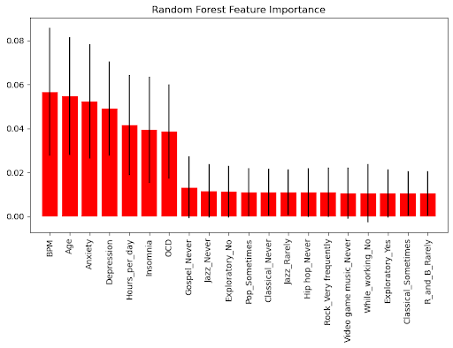

# final_project

## Overview of the project:
The Center for Disease Control (CDC) reports that about 1 in 5 Americans will experience mental health issues in a given year. Often stigmatized, many who suffer do so in silence, seldom seek treatment for fear of judgment and many face dire consequences. Mental Health America (MHA) has declared the month of May as the mental health awareness month to promote awareness among the general public and more importantly to urge the public to seek appropriate treatment for mental illness. In the recent years alternative forms of treatment such as yoga, meditation, tai chi, music etc are being promoted as a means to reduce stress which possibly have a positive impact on mental health.

## Project Goal
The goal of this project is to explore music as an alternative form of therapy for mental health indicators such as anxiety, depression, insomnia and obsessive-compulsive disorder (OCD). The key indicator is whether music ameliorates their mental health condition.

## Data Overview:
The dataset is obtained from Kaggle.com entitled “Music and Mental Health Survey Results” (https://www.kaggle.com/datasets/catherinerasgaitis/mxmh-survey-results). This survey includes a total 736 participants, belonging to a wide range of ages and listening to a variety of genres. The participants self-report their levels of anxiety, depression, insomnia and OCD and whether listening to music either reduced, not changed or worsened their mental health indicators.

## Extract Transform Load:
The data is available as a csv file. The data is first inspected for duplicated and missing values. There was a total of 129 missing values and 0 duplicated values. Some of the columns were renamed for clarity. The cleaned dataset is exported as a csv file and loaded onto a postgres sql database.

## Exploratory Data Analysis

## Data preprocessing for machine learning:
The categorical variables are extracted into a separate dataframe. The number of categorical variables totaled to 23. Each categorical variable was checked whether the number sub-categories within each category was equal to 10 or below. Out of the 23, only one categorical variable, Favorite Genre, had 16 subcategories. A cutoff of 25 will set the number of sub-categorical variables to 10 and thus was chosen as a cutoff to bin the categories that were below 25 under the sub-category named "others". After binning, the categorical variables are encoded to numerical dummy variables by One Hot encoder. After encoding, the categorical variable dataframe is merged back to the original dataframe and the non-encoded categorical variables are dropped from the original dataframe. This second dataframe is exported as a csv file and stored in the postgres sql.

## Machine Learning

Target: Music effect on mental state (Improvement, No improvement/worsen)

Random Forest Classifier with SMOTE resampling resulted in 69.89% accuracy score and a f1-score of 70%. Most important features in this model were Beats per Minute, Age, Anxiety Score, Depression score, and hours listened to music per day.

We also used KerasTuner to find the most accurate deep learning model. The best model had 77% accuracy, but was likely over-fit.

## Conclusion
- The goal of this study was to determine the factors that can predict mental health improvement from music therapy based on a 33 feature dataset.
- The EDA showed Age, hours spent listening, Anxiety, depression as important factors associated with mental health outcome.
- Machine learning models also predicted the 4 factors that showed up in EDA as important predictors of mental health improvement.
- Deep learning models increased prediction accuracy, but are likely over-fit.
